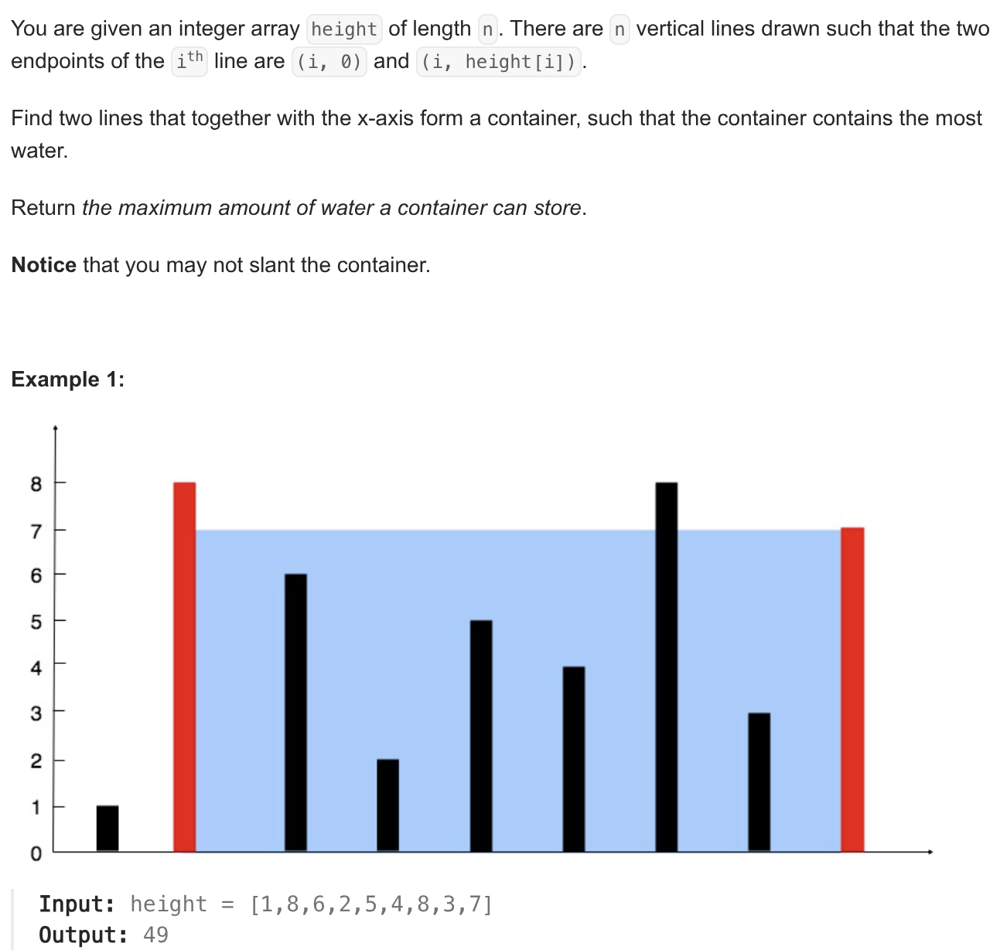

1. Bruteforce approach
   1. Find all the pairs, calculate the maximum maximum for each pair.
   2. TC: O(n^2)
   3. SC: O(1)
2. Two pointer approach
   1. `we start two pointer loop, every time we calculate the amount of water (end-start) * min(arr[end],arr[start]) on every iteration and compare with maximum. now everytime we discard the smallest bar, meaning, if arr[start] is less than the arr[end], we do start++ else end--, this way, we find the other buckets with most water.`
   2. `we've to reduce the width anyways to find the better possibilities in search of a pole whose height is higher, so we do either start++ or end--`

```java
 public static void twoPointer(int arr[]) {
        int start = 0;
        int end = arr.length - 1;

        int maxWater = 0;

        while (start < end) {
            int w = end - start;
            int h = Math.min(arr[start], arr[end]);

            int currWater = w * h;

            maxWater = Math.max(maxWater, currWater);
            if (arr[start] < arr[end])
                start++;
            else
                end--;
        }

        System.out.println(maxWater);
    }
```