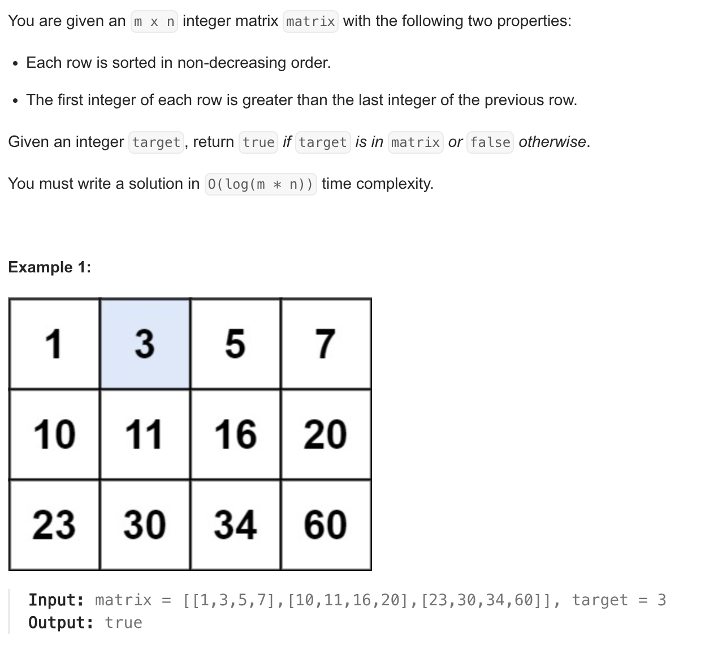

1. Bruteforce approach
   1. loop through all the values and check if it exists.
   2. TC: O(n*m)
   3. SC: O(1)
2. Optimised approach.
   1. given we know that every row is sorted we can take advantage of that.
   2. have a binary search on top level, calculate the mid row,
      1. check if the number is less than the 0th ele of mid row, if so, decrease bottom to mid-1.
      2. if the number is greater than the last ele of mid row, increase the top to mid+1.
      3. else the number either lies in the mid row or it does not exists, so have a binary search.
   3. TC: O(log(m*n))
   4. SC: O(1)

```java
public static boolean bsa(int arr[][], int target) {
        // for (int i = 0; i < arr.length; i++) {
        // if (target >= arr[i][0] && target <= arr[i][arr[i].length]) {
        // ans = binarySearch(arr[i], target);
        // if (ans)
        // break;
        // }
        // } TC: O(mlogn)

        int n = arr[0].length;
        int m = arr.length;

        int top = 0;
        int bottom = m - 1;

        while (top <= bottom) {
            int mid = top + (bottom - top) / 2;

            if (target < arr[mid][0]) {
                bottom = mid - 1;
            } else if (target > arr[mid][n - 1]) {
                top = mid + 1;
            } else {
                return binarySearch(arr[mid], target);
            }
        }
        return false;
    }
```