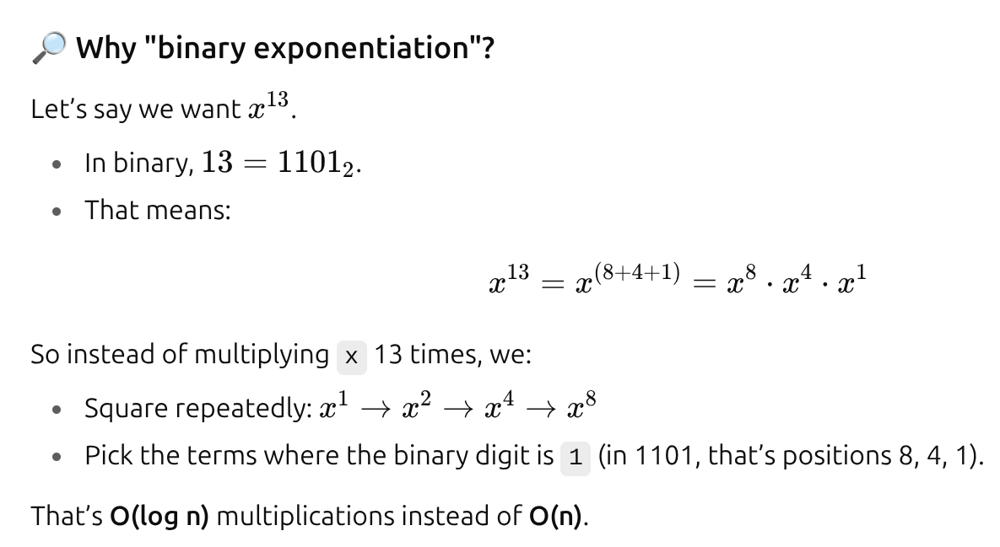
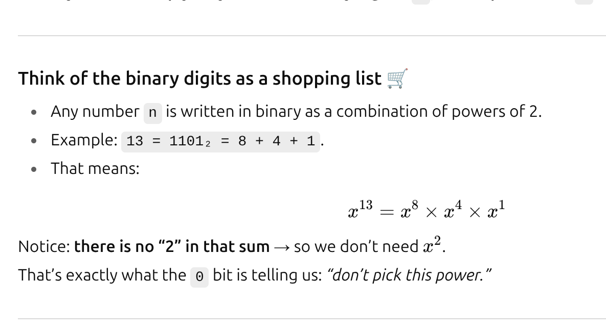
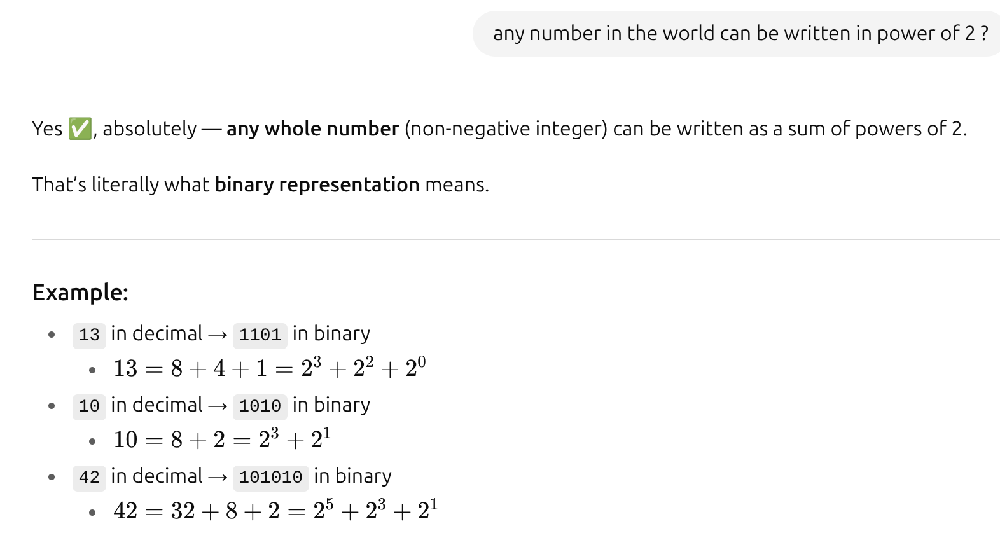

Implement pow(x, n), which calculates x raised to the power n (i.e., xn).

Example 1:

Input: x = 2.00000, n = 10
Output: 1024.00000

1. Bruteforce:
   1. just have a loop from 0 to n, and multiply x each time to a sum.
   2. TC: O(n)
   3. SC: O(1)
2. Binary exponentiation:
   1. 
   2. so we just have to multiply ans with x where all there is 1 bit in the binary form of n (right most).
   3. 
   4. 
   5. TC: O(logn)
   6. SC: O(1)

```java

    public static double myPow(double x, int n) {
        long exp = n;

        if (exp < 0) { // x^-n => 1/(x^n)
            x = 1 / x;
            exp = -exp;
        }

        double ans = 1.0;

        while (exp > 0) {
            if ((exp & 1) == 1) {
                ans *= x;
            }
            x = x * x;
            exp >>= 1;
        }
        return ans;
    }
```