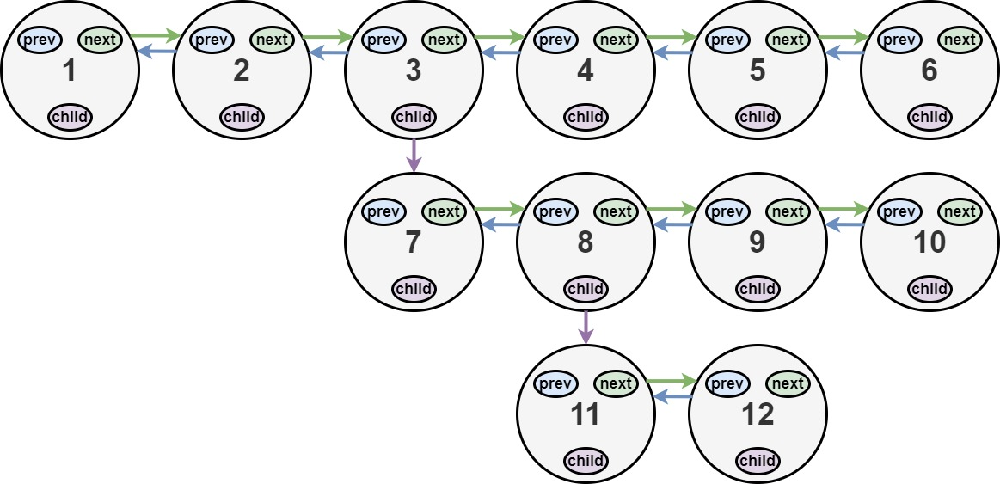
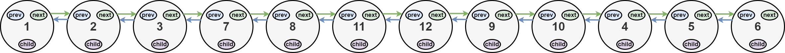

Given a multilevel(a node also has child) double linkedlist, flatten(make a one way linkedlist).

a child and child's level should come before moving to next.


```java
class Node {
    public int val;
    public Node prev;
    public Node next;
    public Node child;
};
```



Input: head = [1,2,3,4,5,6,null,null,null,7,8,9,10,null,null,11,12]
Output: [1,2,3,7,8,11,12,9,10,4,5,6]
Explanation: The multilevel linked list in the input is shown.
After flattening the multilevel linked list it becomes:




1. approach 
   1. starting with `head` as `curr`, loop to the next node(one at a time) until you find a child, 
   2. when you find a child, you take a while loop and loop till the end of it
      1. then you connect the `curr.next` to child head and `childHead.prev` to curr. (connecting head)
      2. then you connect `child.next` (which is at the end) to `next` of `curr` & `child.next.prev` to child itself(connecting tail).
   3. the same since we're incrementing the curr by only 1 any further childs will be encountered later.
   4. TC: O(n)
   5. SC: O(1)

```java
class Solution {
    public Node flatten(Node head) {
        if (head == null)
            return head;

        Node curr = head;

        while (curr != null) {
            if (curr.child != null) {
                Node next = curr.next;
                
                Node child = curr.child;
                Node childHead = curr.child;
                while(child.next != null){
                    child = child.next;
                }

                curr.child = null;
                curr.next = childHead;
                childHead.prev = curr;

                if (next != null) {
                    child.next = next;
                    child.next.prev = child;
                }
            }
            curr = curr.next;
        }
        return head;
    }
}
```