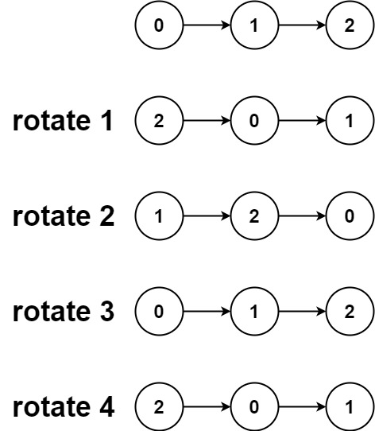

Given the head of a linked list, rotate the list to the right by k places.



Input: head = [0,1,2], k = 4
Output: [2,0,1]


1. Bruteforce
   1. find the tail of the linkedlist.
   2. loop until k > 0
      1. each time, move the tail to head (tail.next = head; head = tail;)
      2. remove the last link to head O(n)
   3. TC: O(k.n)
   4. SC: O(1)
2. optimised approach
   1. count the length of list along with finding the tail.
   2. make the list circular 
   3. k = k % n, just to ensure the if its greater than, it can be greater let say k = 12 and n = 5, instead of loop tiwce which if 5*2=10, rather we just loop two times 2 to ge to the second position.
   4. if k == 0, no rotation needed.
   5. else loop till n-k-1 keeping track of current(ith) element.
   6. take ith_element.next as head.
   7. then break the ith_element.next
   8. TC: O(n)
   9. SC: O(1)


<details>
<summary>optimised</summary>

```java
public ListNode rotateRight(ListNode head, int k) {
        if (head == null || head.next == null || k == 0)
            return head;

        ListNode tail = head;
        int n = 1;
        while (tail.next != null) {
            tail = tail.next;
            n++;
        }

        tail.next = head;
        k = k % n;

        if (k == 0) {
            tail.next = null;
            return head;
        }

        tail = head;
        for (int i = 0; i < n - k - 1; i++) {
            tail = tail.next;
        }

        ListNode newHead = tail.next;
        tail.next = null;

        return newHead;
}
```
</details>