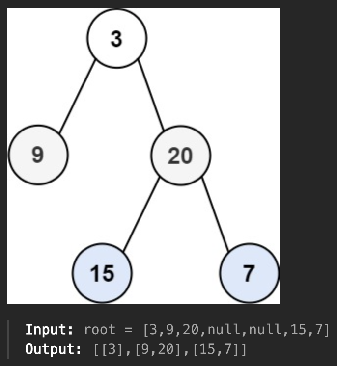

Given a tree, return the elements of each level in array of arrays.



<details>
<summary>Approach</summary>

```js
/**
 * Definition for a binary tree node.
 * function TreeNode(val, left, right) {
 *     this.val = (val===undefined ? 0 : val)
 *     this.left = (left===undefined ? null : left)
 *     this.right = (right===undefined ? null : right)
 * }
 */
/**
 * @param {TreeNode} root
 * @return {number[][]}
 */
var levelOrder = function(root) {
    let ans = [];

    function preorder(root, level){
        if(!root) return;

        if(!ans[level]){
            ans[level] = [root.val];
        }else{
            ans[level].push(root.val);
        }

        preorder(root.left, level+1);
        preorder(root.right, level+1);
    }

    preorder(root, 0);
    return ans;
};
```
</details>