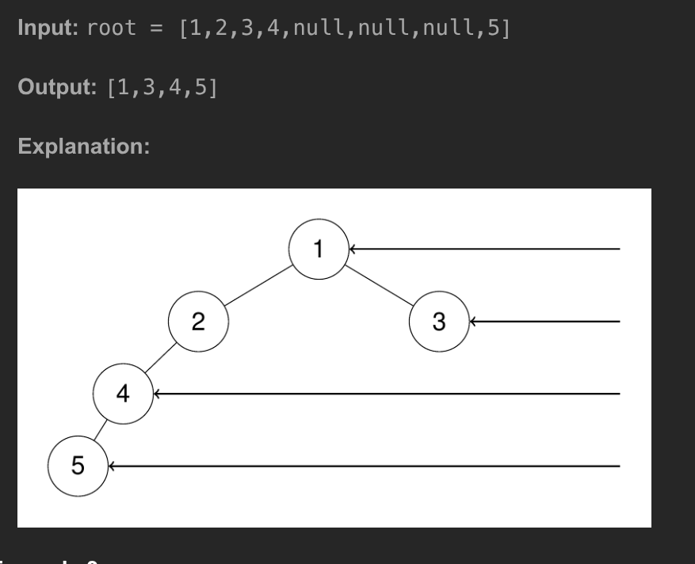

Given a binary tree, get the right side view of it.



<details>
<summary>approach</summary>

```js
/**
 * Definition for a binary tree node.
 * function TreeNode(val, left, right) {
 *     this.val = (val===undefined ? 0 : val)
 *     this.left = (left===undefined ? null : left)
 *     this.right = (right===undefined ? null : right)
 * }
 */
/**
 * @param {TreeNode} root
 * @return {number[]}
 */
var rightSideView = function(root) {
    let map = {};

    function postOrder(root, level){
        if(!root) return;

        postOrder(root.right, level+1);
        postOrder(root.left, level+1);
        if(!(level in map)){
            map[level] = root.val;
        }
    }

    postOrder(root, 0);
    return Object.values(map)
};
```
</details>