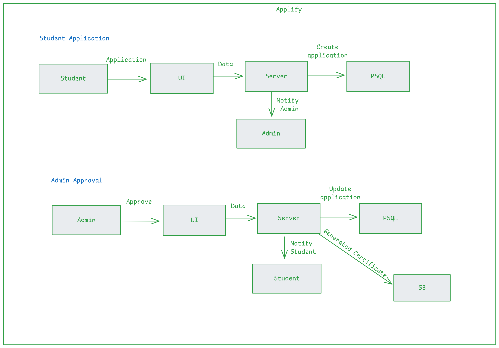

All the operations are just simple client/server calls.

Note: 
1. There's no extra service that notifies student/admin (its only a db update, image is for representation only).
2. Students can download the applications from S3 whenever they are approved.
3. The pdfs we're generating is based on pupeeter and html files.
   
