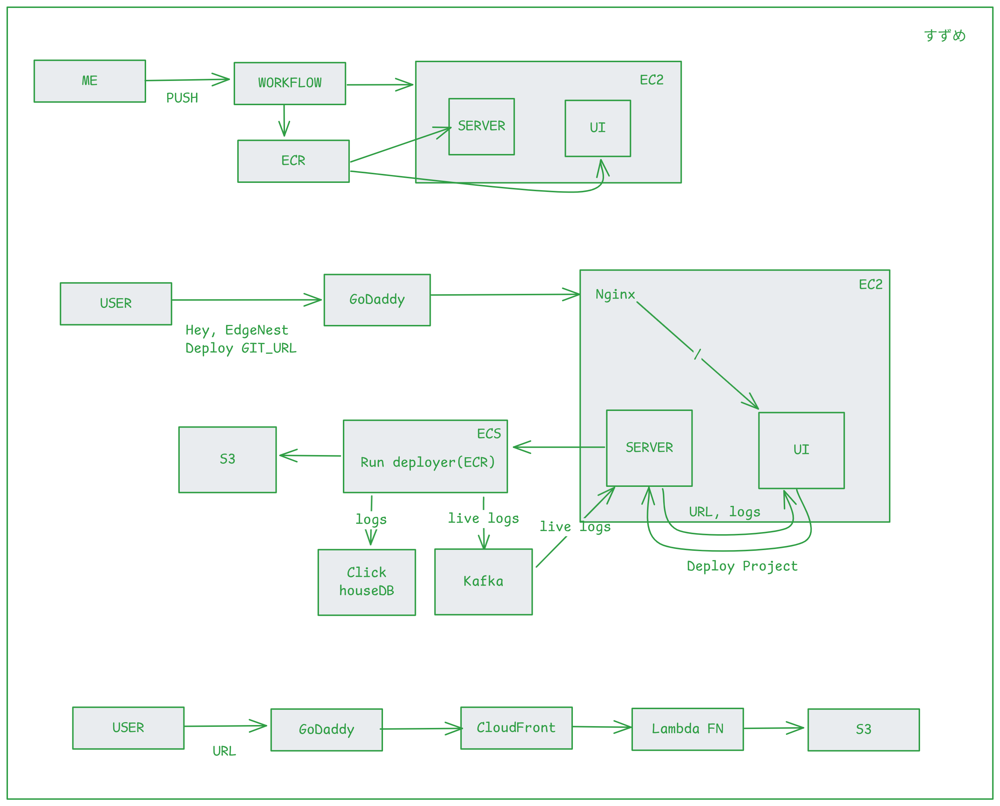

# EdgeNest

## Project Deployment
1. User makes request to the api server with github URL.
  - server sends a unique projectID and projectURL specfic to user project (to client)
  - server creates a TASK on ECS 
    - ECS uses the docker image (built from ./build-server) from ECR
    - builds the projects
    - along with building, it produces(pushes/sends) build logs using Kafka.
    - Once build is done
      - pushes /dist (output) folder contents to S3 (with project slug)
      - pushes the build logs for later use.
2. once user makes call to api server with github URL
  - he/she's auto connected to websocket server
  - it starts consuming(listening) to the messages produced(sent) by kafka in build step and are shown to the user.
3. once build completes, user can visit to the URL
  - the request is handled by AWS cloudfront, passing through lambda function, it returns the user files respectively.

- LoggedIn user can 
  - update project details like, `.env` variables, `custom subdomains` & `build output folder`.

**`i could've gone with ec2+firecracker microvm architecture (optimal for time and cost)`**

