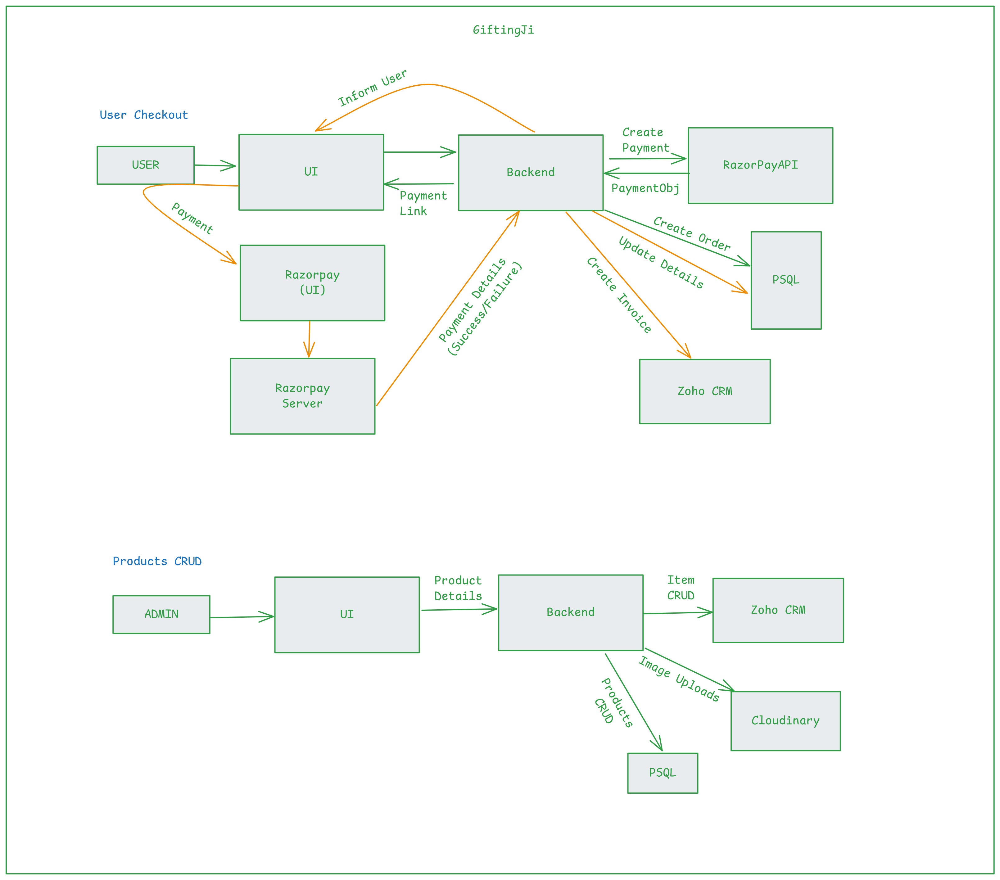

1. User Checkout
   1. User makes a checkout request, the request is sent to the server.
   2. Server validates the details, creates a payment request from Razorpay, store data and provides user with payment link.
   3. User is redirected to Razorpay payments page, once payment is done, razopay server calls our backend api.
   4. Our backend api based on the data, updates the details in DB, creates invoice in ZOHO crm, if successful and notifies the user.
   
2. User Login/Signup
   1. User provides details, a call is made to the server.
   2. Server validates the details and updates Zoho CRM and database accordingly, if valid.

3. Products CRUD
   1. Admin logins to the app, visits admin dashboard.
   2. adds a product, filling the details, details are validated and a server call is made.
   3. server verifies the details, uploads media to Cloudinary & updates DB and Zoho CRM accordingly.

4. All the other operations are normal client/server calls.

