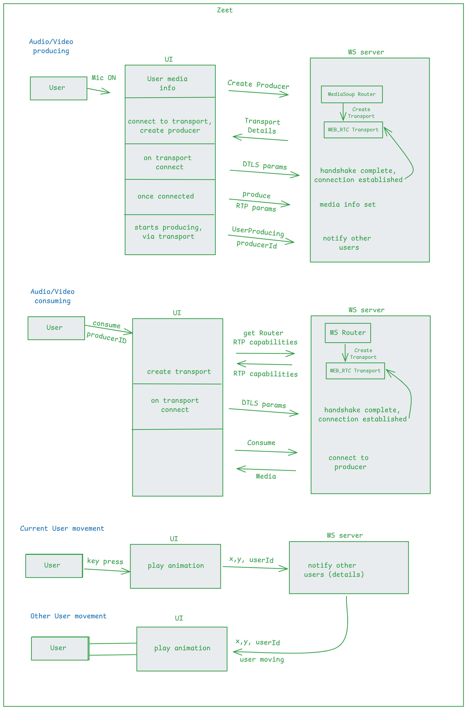

Note:
1. login/signup, space CRUD, logout, chage password/username are normal client/server calls.
2. room users message and room users details are simple websoket calls.

## Image (below)
The diagram shows the architecture of a real-time audio/video collaboration platform using WebRTC, MediaSoup and WebSocket (WS) servers to enable audio/video streaming and real-time user movements.

### What is WebRTC Transport?
WebRTC (Web Real-Time Communication) transport is a protocol that enables direct peer-to-peer communication between browsers/devices for audio, video, and data streaming with low latency.

The UI creates a WebRTC transport to send or receive media via the MediaSoup router (server side). This WebRTC transport handles packet transmission securely and efficiently.

###  DTLS (Datagram Transport Layer Security)
`What is DTLS?`
DTLS is a protocol providing encryption, authentication, and data integrity for datagram-based applications like WebRTC.

After the UI creates a WebRTC transport, it sends DTLS parameters to the WS server. The server completes a DTLS handshake on the transport, establishing an encrypted connection.

### MediaSoup
`What is MediaSoup?`
MediaSoup is an open-source SFU (Selective Forwarding Unit) media server framework for Node.js. It routes real-time audio/video streams between clients without mixing them, allowing efficient multi-party communication.

`Why use MediaSoup?`

- Efficient multi-party communication
- Scalable media routing
- Supports simulcast and SVC for video quality adaptation
- Fine control over media streams

### RTP (Real-time Transport Protocol):
Protocol for delivering audio/video over IP networks.

`RTP Parameters:`
Codec info, payload types, etc., needed to describe media stream for transmission.

`RTP Capabilities:`
The supported codecs and capabilities of the router/client, used to match producer and consumer codecs.

- DTLS (Datagram Transport Layer Security) provides encryption and authentication for WebRTC's media and data channels over UDP.
MCU: Central server receives all streams, decodes, mixes/composes them, and re-encodes a combined stream to send back. This is CPU-intensive and introduces latency.

- MediaSoup (SFU): Selective Forwarding Unit forwards individual streams without decoding them, optimizing CPU usage and reducing latency. The client does more work (decoding multiple streams), but the server scales better 

- WebSocket enables full-duplex, low-latency, real-time bidirectional communication between client and server

- UDP stands for User Datagram Protocol. It’s one of the core protocols of the Internet Protocol (IP) suite used for sending data over a network.
- UDP doesn’t establish a connection before sending data. It just sends packets called datagrams without ensuring the receiver is ready.

`P2P Mesh:`
Every participant sends their media stream directly to every other participant in the call.

If there are N participants, each one sends (N-1) streams.
Each participant also receives (N-1) streams directly from others.

`MediaSoup (SFU - Selective Forwarding Unit):`
Each participant sends their media stream only once to the MediaSoup server.
The server forwards relevant streams to other participants without decoding.

Now, user need to have only 1 transport connection to produce media, likewise, the a user needs to have only one transport connection to consume n media streams

