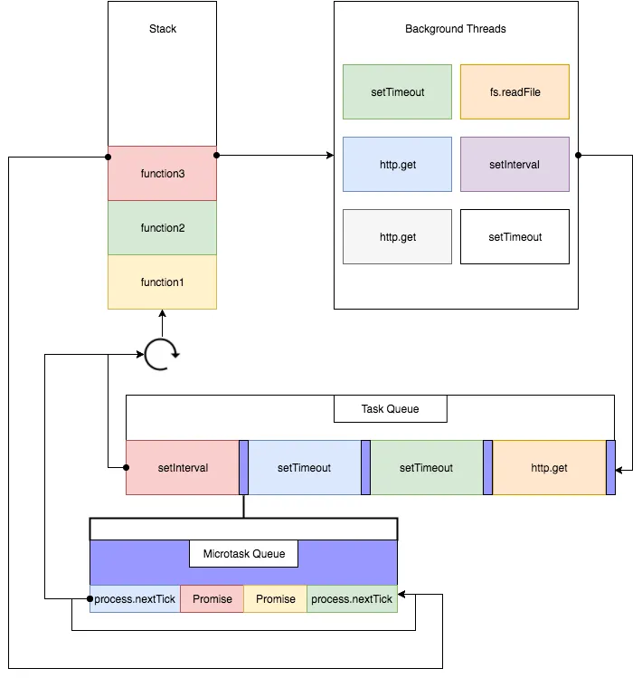

When JS encounters a browser-provided async API (like setTimeout or fetch), it registers the callback with the host environment. The host handles the async work (e.g., timer, network request) and, once completed, queues the callback in the macrotask queue. Meanwhile, the event loop continuously checks if the call stack is empty. If it is, it first drains the microtask queue (e.g., resolved Promises), executing all microtasks in order. Only when the microtask queue is empty does the event loop take the next task from the macrotask queue(callback queue) and push it to the call stack.

ex: Microtask queue

- Promise.then/catch/finally
- queueMicrotask()
- MutationObserver callbacks

ex: Macrotask queue (callback queue)

- setTimeout / setInterval
- setImmediate (Node.js)
- I/O events
- UI events (click, load, etc.)


```
(there's a heap, thats used for memory allocation alongside the callstack) The heap is a region of memory for dynamic allocation.
- Primitive values (number, string, boolean, null, undefined, symbol, bigint) Stored directly on the call stack.
- Reference types (objects, arrays, functions)

It stores objects, arrays, functions, and anything that doesn’t have a fixed size at compile time.

Unlike the call stack, which is structured (LIFO), the heap is unordered and allows memory to be allocated and freed in any order.
```
