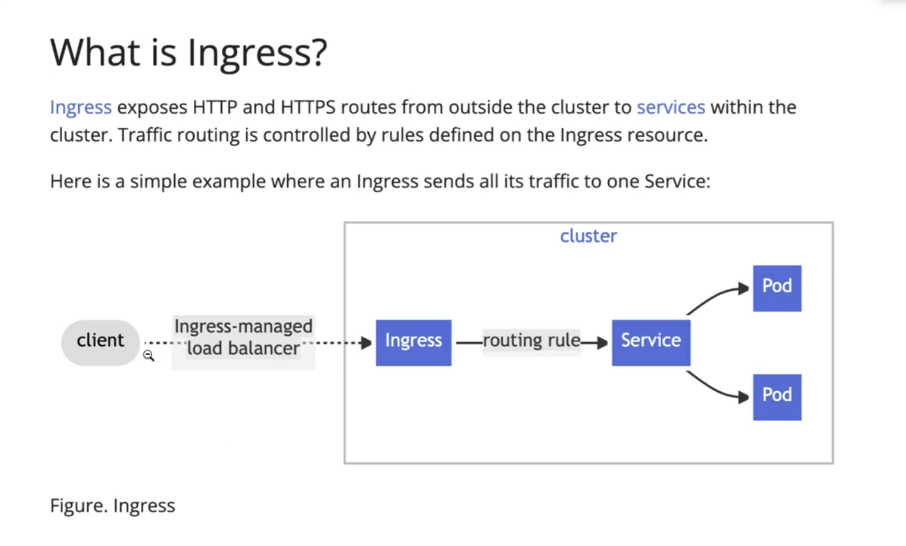
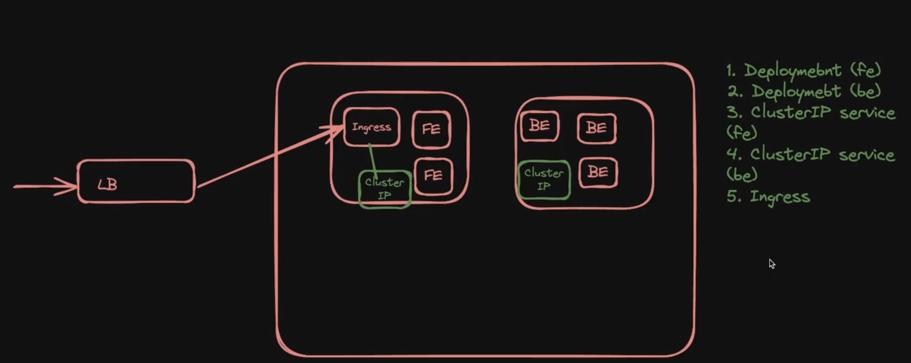

### Ingress
ingress is not specific or part of k8s.

here you don't create your own load balancer, but ingress does it for you.

#### Downside of load balancers.
load balancers in k8s are good but,
1. you'll need a seperate load balancer for each service that points to something specific.
2. you'll have to maintain ssl certificate for all the loadbalancers by yourself (you can do that but assume you have 1000s lbs, would you manager manually ?)
3. there's no central load balancer, that can create a overall ratelimiting combined to all the services, its not only for this, but to do anything related to everything combined, you can't use loadbalancers.
4. there's a limit on no of loadbalancers you can create, meaning, you **might** not be given the privilidge to create over 10k load balancers in aws with 1 account.
**`But, if you have only a bunch of services, and you're okay with creating load balancers you should go for it, just over/under engineer your application.`**

that's where ingress comes in.

**Now how k8s works with ingress**

for you to work with ingress, you need to create `ClusterIP` services that which work as nodeservice/loadbalancer, but not accessible outside, only inside the cluster.

now when user makes a request, its first handled by ingress, based on the rule specification while creation, it routes the request to specific clusterIP service that routes to pod.

**Note: Ingress itself runs inside a pod in k8s.**

whenever you have a ingress controller running, you'll get a ingress managed load balancer, which you dont have to create yourself.

**Note: we can use `helm` a package manager for kubernetes, with which you can easily download ingress controller(s)**

- Ingress is A Kubernetes object (YAML definition) that contains routing rules — e.g., “/api → my-api-service”	
- Ingress Controller  The actual software that reads those rules and routes incoming HTTP/S traffic accordingly and runs inside pod(s) which ultimately meanse, is a docker image running inside a pod.

now there's a single load balancer that routes traffic to ingress which routes traffic `to services(like ClusterIP service)` based on rules.

feel free to go through 
`nginx ingress`, `traefic ingress`docs

**`EX:`**
let say you have 
- a nginx deployment that creates two pods(of nginx)
- you'd need two clusterIP services that points/serves them
- a ingress controller, based on path(req path) routes requests to clusterIP services
- a loadbalancer that routes traffic to ingress controller.