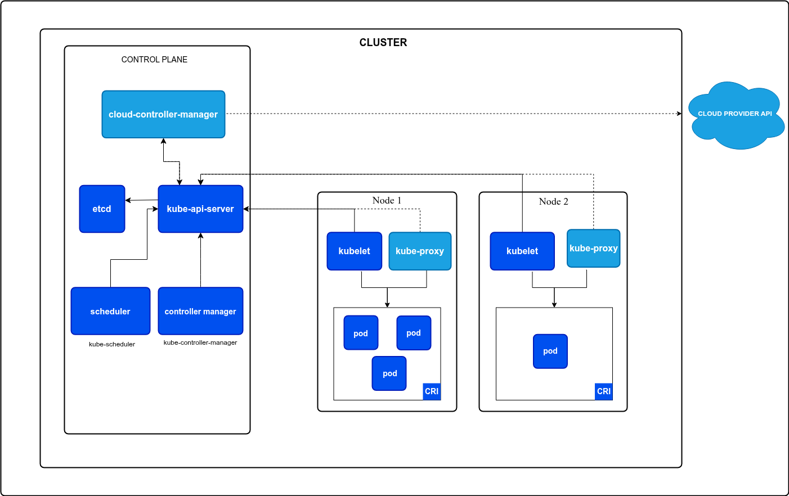

Kubernetes was initially developed by Google (named Borg), later a a new implementation from scratch was made opensource for anyone to use.

kubernetes -> k8s -> k(8chars)s

tradtional problem.
when dockers camein, it made portability so easier that it had mass adoption, but the problem arrived that you need to manage all (a lot if any) the containers manually, there's no single service to manage them, thats where kubernetes comes in.

## kubernetes architecture.

1. when you want to spin up let say 2 instance of your own nodejs containers(docker containers),
you tell the kubernetes api to spin up 2 instances.

2. the KAS(kubernetes-api-server) first updates the state information in etcd key-value store and creates two instance of the image you specified (they are not running yet).

3. the scheduler sees that two containers are ready, then it assigns the containers to be run on two worker nodes you have. scheduler manages load balancing and all.

4. scheduler is able to do this by talking to kubelet inside the worker node. each running container is called a pod.

5. when you want to talk to your server, that happens directly with worker node via kube-proxy, which proxies requests to your node containers.

6. when you want to increase the no of instances of it, you just tell it to KAS again.

# 

here the control pane & worker nodes are seperate physical machines (like you own local machine or cloud ones like ec2), you may have as many worker nodes as you want.

### control pane
it makes descision on scheduling, detecting and responding to events and all.

### kube-apiserver
it exposes kubernetes api that you can interact with.

### etcd
etcd is highly available key-value store used by k8s to store cluster info.

### kube-scheduler
Control plane component that watches for newly created Pods with no assigned node, and selects a node for them to run on.

### kube-controller-manager 
Logically, each controller is a separate process, but to reduce complexity, they are all compiled into a single binary and run in a single process.

There are many different types of controllers. Some examples of them are:

Node controller: Responsible for noticing and responding when nodes go down.
Job controller: Watches for Job objects that represent one-off tasks, then creates Pods to run those tasks to completion.
EndpointSlice controller: Populates EndpointSlice objects (to provide a link between Services and Pods).
ServiceAccount controller: Create default ServiceAccounts for new namespaces.
The above is not an exhaustive list.

### CRI (container runtime interface)
these are the components you need to run the containers, 
like if you want to run docker container, you need docker engine.