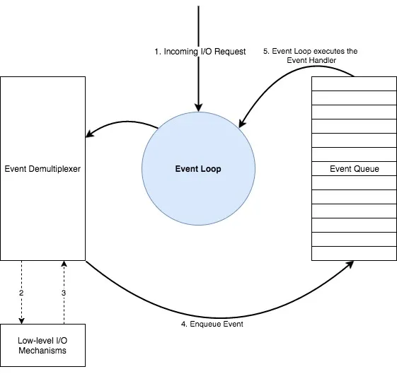
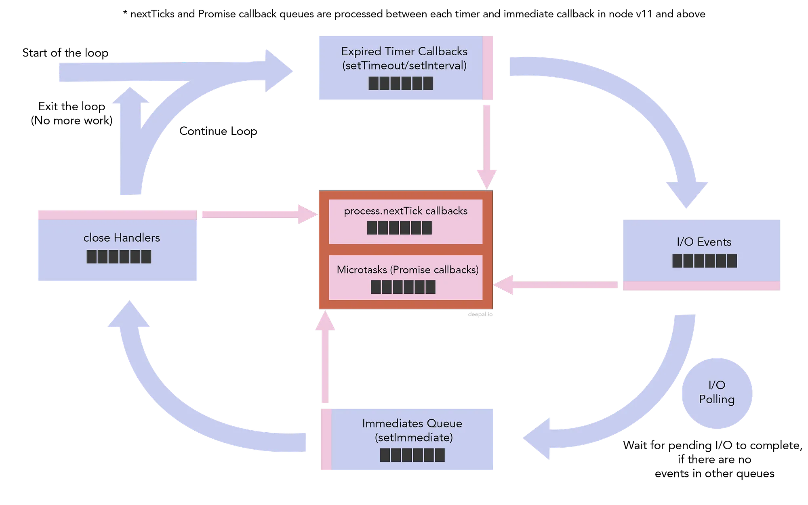
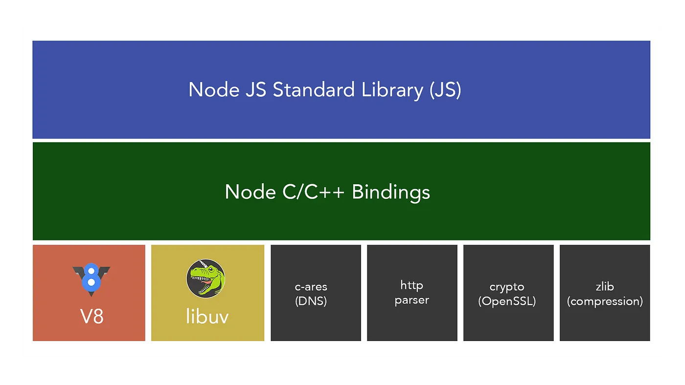

# Node.js Event Loop and I/O Model

[Reference](https://blog.insiderattack.net/event-loop-and-the-big-picture-nodejs-event-loop-part-1-1cb67a182810)

Node.js works in an **event-driven model**.

An I/O operation can mean:
- File I/O
- Network requests
- Database queries

Generally, any work that involves **external devices except the CPU** is called I/O.  
The most common abstract I/O types are:
- File operations
- TCP/UDP network operations  
Additionally, **DNS lookups** (host-to-IP resolution) may consume thread pool threads.

---

## How Events Work

- All I/O requests eventually generate an event (completion or failure).  
- Once the I/O request is processed and data is available, the **event demultiplexer** adds it to the **event queue**.  
- Events are processed from the queue in FIFO order.



---

## Network I/O vs File I/O

**Network I/O**
- OS provides async mechanisms for sockets:  
  - Linux → epoll  
  - macOS → kqueue  
  - Windows → IOCP  
- Node can directly wait for events (e.g., “data ready to read”) without blocking.

**File I/O**
- OS-level async APIs are limited or blocking at kernel level.
- Node uses a **thread pool** (libuv) to achieve asynchrony.  
  - `fs.readFile` isn’t async at kernel level; it runs in a background thread.  
  - By default, `libuv` uses **4 threads max** for I/O.  
  - If 8 simultaneous file reads are requested, only 4 are processed immediately; others wait.

**Key Point:**  
Network I/O is handled by the OS and notifies Node.js via the event loop.  
File I/O and CPU-heavy tasks use the **libuv thread pool**.

---

## Tasks Using Thread Pool

Besides file I/O, some **CPU-intensive functions** run on libuv’s thread pool:
- `crypto.pbkdf2`
- Async versions of `crypto.randomBytes`, `crypto.randomFill`
- Async versions of `zlib`

Running these on the thread pool prevents blocking the main event loop.

---

## libuv

Libuv is a **cross-platform support library** for Node.js.  
It provides:
- Event-driven async I/O
- Handles & streams abstraction for sockets and other entities
- Cross-platform file I/O & threading

---

## Event Queues in Node.js

Unlike a single queue in the abstract reactor pattern, Node.js has **multiple queues**.

### 4 Normal Queues
1. **Timers Queue** – Callbacks of expired timers (`setTimeout`, `setInterval`)  
2. **I/O Events Queue** – Completed I/O callbacks  
3. **Immediates Queue** – Callbacks from `setImmediate`  
4. **Close Handlers Queue** – Callbacks for close events  

(*Note: Some are implemented as heaps, e.g., timers.*)

### 2 Intermediate Queues
- **Next Tick Queue** – Callbacks from `process.nextTick`  
- **Microtasks Queue** – Resolved Promise callbacks  



- After each phase, intermediate queues are emptied.  
- **`process.nextTick` has the highest priority.**

---

## Special Notes on `process.nextTick` and Promises

- `process.nextTick` is implemented in Node.js, not libuv.  
- Since Node v11, nextTick and microtasks run between **each individual** callback (not only between phases).  
- These run when C++ code calls back into JS:

```
[libuv C++] ----calls---> [Node C++ binding] ----calls---> [JS callback]
                               |
                               | (after JS callback finishes)
                               v
                        drain nextTick + Promises
```

---

## Performance Considerations

- The event loop won’t block if there are pending tasks.  
- Efficiency depends more on **thread-to-core ratio** than just thread count.  
- If threads > CPU cores, excessive context switching reduces performance.

Node.js can accept many requests quickly, but **response time depends** on:
- Event loop scheduling
- Thread pool usage
- CPU core availability

---

## DNS in Node.js

1. **`dns.lookup(hostname)`**  
   - Uses OS resolver (same as `ping`/`curl`).  
   - Follows OS rules.  

2. **`dns.resolve*()`**  
   - Bypasses OS resolver.  
   - Sends DNS queries directly via UDP/TCP.  
   - Asynchronous resolution independent of OS.

---

## Summary

- **Network I/O:** handled by OS async APIs → Event loop notified.  
- **File I/O & CPU-heavy tasks:** handled by **libuv thread pool**.  
- **Event loop:** manages multiple queues (timers, I/O, immediates, close, nextTick, microtasks).  
- **Performance tuning:** adjust libuv thread pool size based on workload.  
- Node.js = event loop (libuv) + thread pool + async I/O model.


